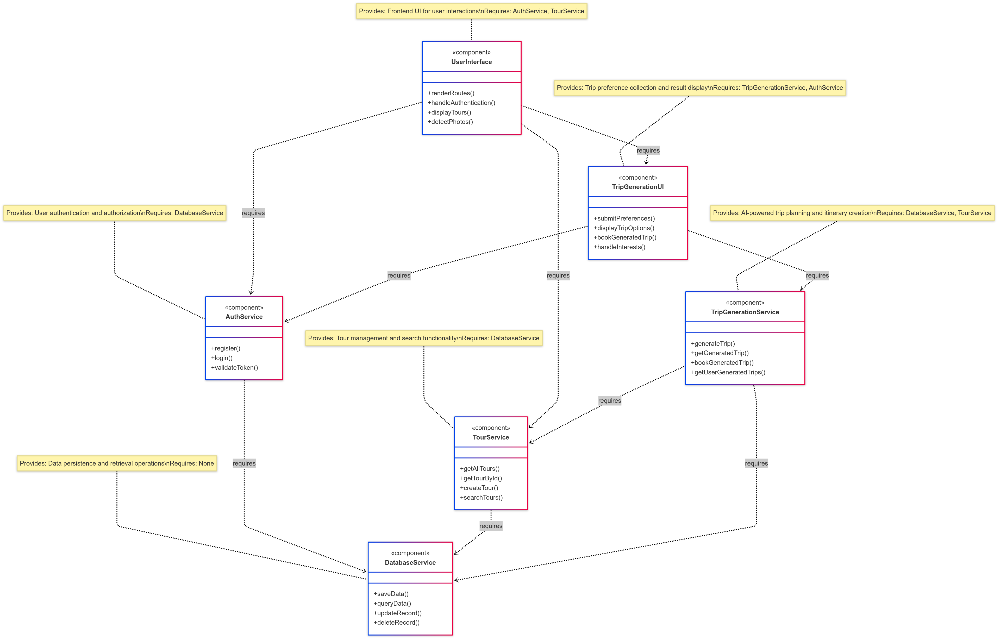

  

<!-- project overview -->

Tourivo is a smart tourism website that enhances how people discover and share travel experiences. It offers a modern, intuitive platform built to make trip planning and exploration easier for everyone.

  

<!-- System Design -->

### Database Schema

### Component Diagram

### Deployment Diagram

### Architecture Diagram

  

<!-- Project Highlights -->

### Tourivo

.AI-generated travel tours offering personalized trip suggestions

.AI-powered photo detection for automatic tagging and organization

.Shared albums allowing users to create and contribute to group travel collections

.Interactive destination explorer with rich visuals and location details

  

<!-- Demo -->

### User Screens (Mobile)

| Login screen                            | Register screen                       | Register screen                       |
| --------------------------------------- | ------------------------------------- | ------------------------------------- |
|  |  |  |

### Admin Screens (Web)

| Login screen                            | Register screen                       |
| --------------------------------------- | ------------------------------------- |
|  |  |

  

<!-- Development & Testing -->

### Add Title Here

| Services                            | Validation                       | Testing                        |
| --------------------------------------- | ------------------------------------- | ------------------------------------- |
|  |  |  |

  

<!-- Deployment -->

### Add Title Here

- Description here.

| Postman API 1                            | Postman API 2                       | Postman API 3                        |
| --------------------------------------- | ------------------------------------- | ------------------------------------- |
|  |  |  |

  
